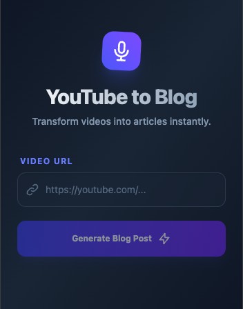
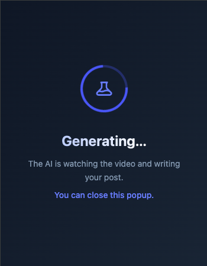
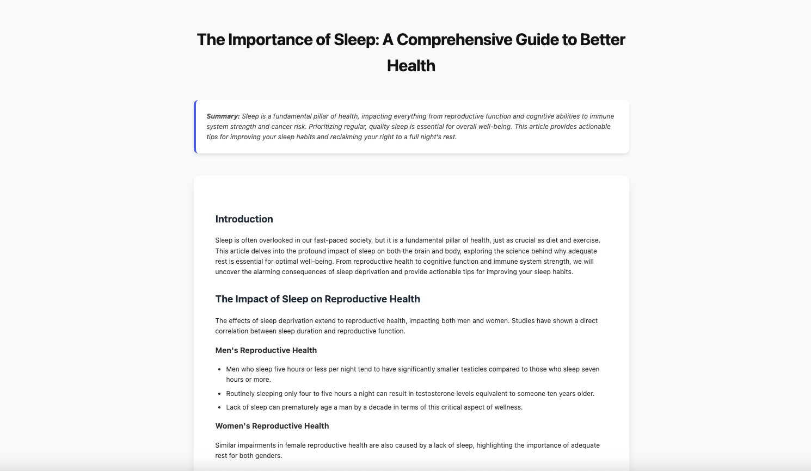

# YouTube to Blog Post Converter

A full-stack application that converts YouTube video audio into structured blog posts using Google Gemini AI.

## Architecture
- **Backend**: FastAPI (Python) on Google Cloud Run.
- **Frontend**: React + Vite on Firebase Hosting.
- **AI**: Google Gemini 1.5 Flash.
- **Audio**: `pytubefix` (with OAuth2) for YouTube audio extraction.

## Deployment

### 1. Backend (Cloud Run)
The backend handles audio downloading and AI processing.

```bash
cd backend
gcloud run deploy backend \
  --source . \
  --region us-central1 \
  --allow-unauthenticated
```
*Note: This uploads the `tokens.json` file securely to the container.*

### 2. Frontend (Firebase Hosting)
The frontend provides the user interface.

```bash
# Build the React app
npm run build --prefix frontend

# Deploy to Firebase
firebase deploy --only hosting
```

## Maintenance: Keeping YouTube Tokens Alive

This app uses **OAuth2** to download audio from YouTube. The credentials are stored in `backend/tokens.json`.

**If downloads stop working (e.g., "Sign in to confirm you're not a bot" errors):**

1.  **Regenerate Tokens Locally:**
    Run this script and follow the browser prompts to log in again.
    ```bash
    python3 backend/generate_token.py
    ```
    This will update the `backend/tokens.json` file.

2.  **Redeploy the Backend:**
    Push the updated tokens to Cloud Run.
    ```bash
    cd backend
    gcloud run deploy backend \
      --source . \
      --region us-central1 \
      --allow-unauthenticated
    ```

## Local Development

1.  **Backend:**
    ```bash
    cd backend
    uvicorn main:app --reload --port 8080
    ```

2.  **Frontend:**
    ```bash
    cd frontend
    npm run dev
    ```
    *Note: Update `frontend/.env` to `VITE_API_URL=http://localhost:8080` for local testing.*

## Chrome Extension

The project includes a Chrome Extension for quick access to the converter.

### Installation (Developer Mode)
1.  **Build the extension:**
    ```bash
    cd extension
    npm run build
    ```
    This creates a `dist` folder.
2.  Open Chrome and go to `chrome://extensions`.
3.  Enable **Developer mode** (top right).
4.  Click **Load unpacked**.
5.  Select the `extension/dist` folder.

### Features
- **One-Click Generation:** Automatically grabs the YouTube URL from your active tab.
- **Background Processing:** You can close the popup; the extension works in the background.
- **Notifications:** Get a system notification when your blog post is ready.
- **Smart Badge:** The icon shows "..." (processing), "DONE" (ready), or "ERR" (error).
- **Offline Access:** View the full blog post in a new tab or download it as HTML.

## Screenshots

| Start Screen | Ready to Generate |
|:---:|:---:|
|  |  |

| Processing | Result Ready |
|:---:|:---:|
|  |  |

### Full Blog Post View

